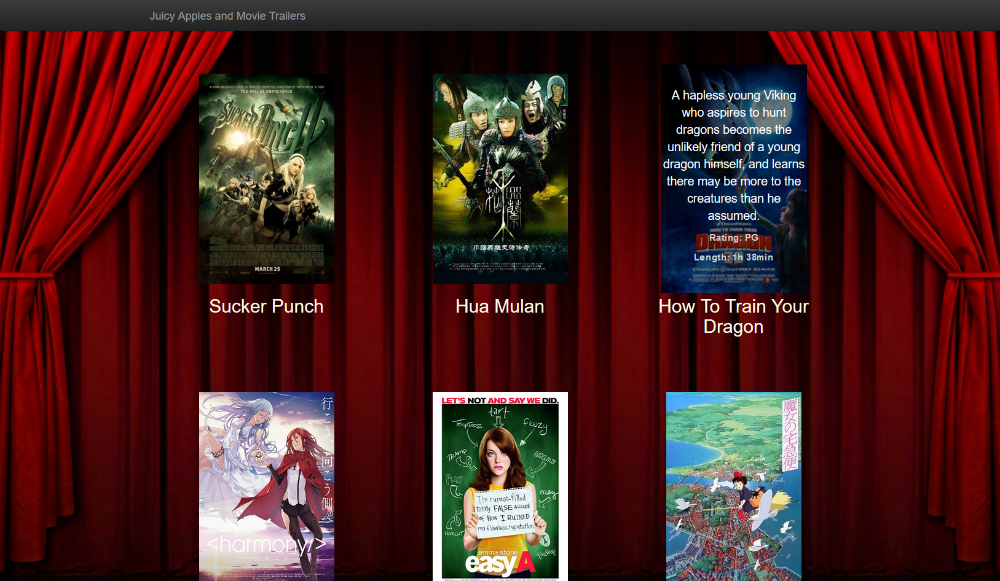

# Movie Trailer Website

## About:
These python files were made for a Python Project for a Udacity Intro to Programming class. When run, the code dynamically creates an HTML file, filling in data from the *entertainment_center.py* file after parsing it using the *media.py* file. The compiled HTML file is then opened in the browser.
This is my second project done using Python, so there are possibly ways to make the code a little more concise and efficient. Regardless, I enjoyed learning Python through this project.

## Instructions:
To open the website, simply run the *fresh_tomatoes.py* file with Python 2.7 installed. The pictures on the website can be hovered over for info on that movie, or clicked to play a YouTube trailer of that movie.

## Dependencies:
This program is run on Python 2.7. The trailers are hosted by YouTube.
* Python 2.7: https://www.python.org/downloads/release/python-2714/
* YouTube: https://www.youtube.com/

## Notes:
The website name differs from the python file name it is compiled by. This is due to nomenclature requirements of the project by Udacity. Otherwise the file would be named "*juicy_apples.py*".
